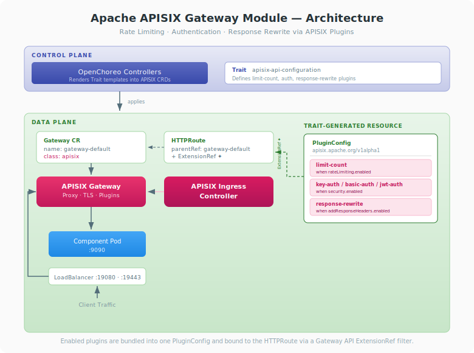

# Apache APISIX Gateway Module for OpenChoreo Data Plane

This document provides comprehensive documentation for integrating [Apache APISIX](https://apisix.apache.org/) as the API gateway in the OpenChoreo data plane, replacing the default kgateway (Envoy-based) implementation.

## Table of Contents

- [Overview](#overview)
- [Compatibility](#compatibility)
- [High-Level Architecture](#high-level-architecture)
- [Installation](#installation)
- [APISIX API Configuration Trait](#apisix-api-configuration-trait)
- [Configuration](#configuration)
- [Maintenance](#maintenance)
- [Customization](#customization)

---

## Overview

OpenChoreo uses the [Kubernetes Gateway API](https://gateway-api.sigs.k8s.io/) as the standard API for exposing component endpoints to public or internal networks. Because the Gateway API is a vendor-neutral Kubernetes standard, the gateway layer is easily pluggable and extensible across vendors — any Gateway API-compliant controller can serve as the ingress layer without changes to the control plane or the OpenChoreo ComponentTypes.

The Apache APISIX module replaces the default kgateway (Envoy) with [Apache APISIX](https://apisix.apache.org/) and the [APISIX Ingress Controller](https://apisix.apache.org/docs/ingress-controller/getting-started/), providing advanced API management capabilities such as rate limiting, authentication, request/response transformation, and observability — all through Kubernetes-native CRDs.



### Key Design Decisions

- **Standard Gateway API as the contract**: OpenChoreo components create `HTTPRoute` resources that reference a `Gateway` by name. The gateway implementation is transparent to the control plane.
- **APISIX Ingress Controller 2.x (Gateway API path)**: This module uses the controller's native Gateway API support (the `apisix.apache.org/v1alpha1` CRD family — `GatewayProxy`, `PluginConfig`, `Consumer`), not the legacy `ApisixRoute` (`apisix.apache.org/v2`) CRDs.
- **Plugins bound via `ExtensionRef`**: API management policies are expressed as an APISIX `PluginConfig` and attached to an `HTTPRoute` rule through a Gateway API `ExtensionRef` filter — no annotations on the route.
- **Helm-driven configuration**: The `gatewayClassName` in the data plane Helm chart determines which gateway controller processes the `Gateway` CR and its routes.
- **No control plane changes required**: Switching gateways only requires data plane reconfiguration. The rendering pipeline, endpoint resolution, and release controllers work unchanged.

---

## Compatibility

Apache APISIX is a pluggable replacement for the default kgateway in the OpenChoreo data plane. This module installs APISIX independently of OpenChoreo via the official Helm charts, so the APISIX version is not tied to your OpenChoreo release — the APISIX Ingress Controller implements the [Kubernetes Gateway API](https://gateway-api.sigs.k8s.io/).

The table below lists the APISIX versions this module targets against the Gateway API version each OpenChoreo release installs with its data plane:

| OpenChoreo version | Kubernetes Gateway API | `apisix` chart | `apisix-ingress-controller` chart | APISIX Ingress Controller | Apache APISIX |
| ------------------ | ---------------------- | -------------- | --------------------------------- | ------------------------- | ------------- |
| v0.x.x             | v1.4.1                 | 2.15.0         | 1.2.0                             | 2.1.0                     | 3.17.0        |
| v1.0.x             | v1.4.1                 | 2.15.0         | 1.2.0                             | 2.1.0                     | 3.17.0        |
| v1.1.x             | v1.4.1                 | 2.15.0         | 1.2.0                             | 2.1.0                     | 3.17.0        |
| v1.2.x             | v1.5.1                 | 2.15.0         | 1.2.0                             | 2.1.0                     | 3.17.0        |

> **⚠️ Gateway API support caveat:** The APISIX Ingress Controller **2.x line bundles Kubernetes Gateway API v1.3.0**. The Gateway API versions OpenChoreo ships — **v1.4.1 and v1.5.1 — are newer than APISIX's bundled version**, so this combination is *ahead of APISIX's documented Gateway API version*.
>
> In practice the controller consumes only the stable Gateway API surface this module relies on (`Gateway`, `HTTPRoute v1`, `parentRefs`/`backendRefs`, rule-level filters including `ExtensionRef`), which is unchanged across v1.3–v1.5. This module was **verified end-to-end on OpenChoreo v1.2.x (Gateway API v1.5.1)** with the versions above — rate limiting (429), key-auth (401→200), and response headers all functioned. Gateway API features introduced in v1.4/v1.5 may not be supported by the 2.x controller.
>
> **Gateway API integration is new in APISIX Ingress Controller 2.0 (released December 2025).** Pin the chart versions above for reproducibility. One consequence of the bundled v1.3.0 CRDs: the controller chart's CRDs must be installed selectively so they don't downgrade OpenChoreo's Gateway API v1.5.1 — see [Step 3](#step-3-install-the-apisix-ingress-controller).
>
> The `apisix-api-configuration` trait itself uses only the stable `apisix.apache.org/v1alpha1` `PluginConfig` API and the APISIX plugin schemas (`limit-count`, `key-auth`, `response-rewrite`), which are unaffected by Gateway API version differences.

---

## High-Level Architecture

### Gateway Integration in OpenChoreo

```
┌─────────────────────────────────────────────────────────────┐
│                     CONTROL PLANE                           │
│                                                             │
│   Renders component templates and applies resources         │
│   (Deployment, Service, HTTPRoute) to the data plane        │
│                                                             │
└─────────────────────────────┬───────────────────────────────┘
                              │
                     applies resources
                              │
                              ▼
┌─────────────────────────────────────────────────────────────┐
│                     DATA PLANE                              │
│                                                             │
│              ┌──────────────────────────────┐               │
│              │   Component Resources        │               │
│              │   ┌────────────┐             │               │
│              │   │ Deployment │             │               │
│              │   └────────────┘             │               │
│              │   ┌────────────┐             │               │
│              │   │  Service   │             │               │
│              │   └─────┬──────┘             │               │
│              │         │ backendRef         │               │
│              │   ┌─────┴──────┐             │               │
│              │   │ HTTPRoute  │             │               │
│              │   │ parentRef ─┼────┐        │               │
│              │   │ + ExtRef ──┼──┐ │        │               │
│              │   └────────────┘  │ │        │               │
│              └───────────────────┼─┼────────┘               │
│                                  │ │                        │
│              ┌───────────────────┼─┴──────────┐             │
│              │   Gateway CR      │            │             │
│              │   name: gateway-default        │             │
│              │   gatewayClassName: apisix ◄─── Configurable │
│              │   listeners: http/https        │             │
│              └───────────────┬────────────────┘             │
│                              │ watches                      │
│              ┌───────────────┴────────────────┐             │
│              │   APISIX Ingress Controller    │             │
│              │   - Watches Gateway, HTTPRoute │             │
│              │   - Resolves GatewayProxy conn │             │
│              │   - Pushes config to APISIX    │             │
│              └───────────────┬────────────────┘             │
│                              │ configures (admin API)        │
│              ┌───────────────┴────────────────┐             │
│              │   Apache APISIX (Proxy)        │             │
│              │   - Processes traffic          │             │
│              │   - TLS termination            │             │
│              │   - Plugin execution           │             │
│              │   - Routes to backends         │             │
│              └───────────────┬────────────────┘             │
│                              │                              │
│                         LoadBalancer                        │
│                         :19080 (HTTP)                       │
│                         :19443 (HTTPS)                      │
└─────────────────────────────────────────────────────────────┘
                              │
                          Client Traffic
```

### Component Breakdown

| Component                      | Role                                                                                                                            |
| ------------------------------ | ----------------------------------------------------------------------------------------------------------------------------- |
| **APISIX Ingress Controller**  | Watches Gateway API resources (Gateway, HTTPRoute, PluginConfig, Consumer) and translates them into APISIX proxy configuration |
| **Apache APISIX (Proxy)**      | Processes ingress traffic, terminates TLS, executes plugins (rate limiting, auth, etc.), and routes to backend services        |
| **GatewayProxy**               | `apisix.apache.org/v1alpha1` CRD that tells the controller how to connect to the APISIX data plane (admin API endpoint + key)  |
| **Gateway CR**                 | Kubernetes Gateway API resource that defines listeners (ports, protocols, TLS). Created by Helm during data plane installation  |
| **GatewayClass**               | Declares that `apisix.apache.org/apisix-ingress-controller` handles Gateway CRs with class `apisix`                            |
| **HTTPRoute**                  | Gateway API route resource. Created by OpenChoreo per component. References the Gateway CR via `parentRefs`                     |
| **PluginConfig**               | APISIX CRD holding a bundle of plugins. Bound to an HTTPRoute rule via an `ExtensionRef` filter                                |
| **Consumer**                   | APISIX CRD holding a credential (API key, basic-auth user, JWT key) consumed by the auth plugins                              |

### How Endpoint URLs Are Resolved

The ReleaseBinding controller resolves endpoint URLs by inspecting rendered HTTPRoutes:

1. Extracts `backendRef` port from the HTTPRoute (matches to workload endpoint)
2. Extracts `hostname` from the HTTPRoute spec
3. Looks up the Gateway referenced in `parentRefs`
4. Resolves the HTTPS port from DataPlane/Environment gateway configuration
5. Constructs the invoke URL: `https://<hostname>[:<port>]/<path>`

This resolution is gateway-implementation-agnostic — it only reads standard Gateway API fields.

### Traffic Flow

```
Client
  │
  ▼
LoadBalancer (:19443)
  │
  ▼
Apache APISIX (TLS termination)
  │
  ├─ Match HTTPRoute rules (hostname + path)
  ├─ Execute plugins (limit-count, key-auth, response-rewrite)
  │
  ▼
Service (ClusterIP)
  │
  ▼
Pod (application container)
```

---

## Installation

### Prerequisites

- An existing OpenChoreo deployment, with or without the default kgateway installed
- Helm 3.x
- kubectl configured with cluster access
- cert-manager installed (for TLS certificate management)

> **APISIX Ingress Controller version:** These steps target **APISIX Ingress Controller 2.x**, whose Gateway API support was introduced in the 2.0 rewrite (December 2025). The 1.x controller does **not** support the Gateway API path used here.

### Step 1: Remove kgateway (if currently installed)

If the data plane was previously deployed with kgateway, remove the existing Gateway CR so it can be recreated with the APISIX GatewayClass:

```bash
kubectl delete gateway gateway-default -n openchoreo-data-plane
```

> **Single cluster mode:** Do not remove the kgateway controller, GatewayClass, or its deployments. The control plane and observability plane gateways depend on kgateway. Only the data plane gateway is pluggable.

In multi-cluster deployments where the data plane runs on a separate cluster, kgateway can be fully removed:

```bash
# Multi-cluster only: remove kgateway entirely from the data plane cluster
kubectl delete gatewayclass kgateway
kubectl delete deployment -l app.kubernetes.io/name=kgateway -n openchoreo-data-plane
kubectl delete svc -l app.kubernetes.io/name=kgateway -n openchoreo-data-plane
```

### Step 2: Install Apache APISIX (data plane)

```bash
# Add the Apache APISIX Helm repository
helm repo add apisix https://apache.github.io/apisix-helm-chart
helm repo update

# Install the APISIX data plane.
# The chart version is pinned for reproducibility (2.15.0 ships APISIX 3.17.0).
# service.http.containerPort=19080 makes APISIX listen (node_listen) on 19080, matching the
# Gateway CR listener port; the admin API allow-list is opened so the in-cluster ingress
# controller can reach it.
helm install apisix apisix/apisix \
  --version 2.15.0 \
  --namespace openchoreo-data-plane \
  --set service.type=LoadBalancer \
  --set service.http.servicePort=19080 \
  --set service.http.containerPort=19080 \
  --set apisix.ssl.enabled=true \
  --set service.tls.servicePort=19443 \
  --set 'apisix.admin.allow.ipList={0.0.0.0/0}' \
  --set etcd.enabled=true

# Wait for APISIX to be ready
kubectl wait --for=condition=ready pod \
  -l app.kubernetes.io/name=apisix \
  -n openchoreo-data-plane \
  --timeout=300s
```

> **Admin API key:** The APISIX chart ships a well-known default admin key (`edd1c9f034335f136f87ad84b625c8f1`). Override it for any non-local environment via `--set apisix.admin.credentials.admin=<your-key>` and use the same value in the GatewayProxy below.

#### Label the APISIX gateway pods

The data plane NetworkPolicy only admits traffic to component pods from pods carrying the `openchoreo.dev/system-component=gateway` label. The APISIX chart has no value for custom pod labels, so patch the Deployment (this recreates the pods with the label):

```bash
kubectl patch deployment apisix -n openchoreo-data-plane --type merge \
  -p '{"spec":{"template":{"metadata":{"labels":{"openchoreo.dev/system-component":"gateway"}}}}}'
```

> **Note:** A later `helm upgrade` re-renders the Deployment without this label, so re-apply the patch after upgrading APISIX. Without the label, requests to component pods are dropped (connection reset / timeout) even though routing is otherwise correct.

### Step 3: Install the APISIX Ingress Controller

The controller chart bundles **two** sets of CRDs in its `crds/` directory: `apisixic-crds.yaml` (the `apisix.apache.org` CRDs this module needs) and `gwapi-crds.yaml` (Kubernetes Gateway API **v1.3.0**). OpenChoreo already installs Gateway API **v1.5.1** and enforces a `ValidatingAdmissionPolicy` (`safe-upgrades.gateway.networking.k8s.io`) that **rejects installing Gateway API CRDs older than v1.5.0**. If you let Helm install the bundled CRDs, the install fails:

```
... gateways.gateway.networking.k8s.io is forbidden: ValidatingAdmissionPolicy
'safe-upgrades.gateway.networking.k8s.io' ... Installing CRDs with version before v1.5.0 is prohibited
```

So install the APISIX CRDs **only**, and install the controller with `--skip-crds` (leaving OpenChoreo's Gateway API v1.5.1 CRDs untouched):

```bash
# 1. Pull the chart and apply ONLY the apisix.apache.org CRDs (skip the bundled Gateway API CRDs)
helm pull apisix/apisix-ingress-controller --version 1.2.0 --untar
kubectl apply --server-side -f apisix-ingress-controller/crds/apisixic-crds.yaml

# 2. Install the controller, skipping its bundled CRDs.
# The chart defaults are already correct: config.controllerName=apisix.apache.org/apisix-ingress-controller
# and config.disableGatewayAPI=false (Gateway API enabled), so no overrides are needed.
helm install apisix-ingress-controller apisix/apisix-ingress-controller \
  --version 1.2.0 \
  --namespace openchoreo-data-plane \
  --skip-crds

kubectl wait --for=condition=ready pod \
  -l app.kubernetes.io/name=apisix-ingress-controller \
  -n openchoreo-data-plane \
  --timeout=300s
```

> **Note:** The controller's connection to the APISIX data plane is supplied by the `GatewayProxy` (Step 4) referenced from the Gateway CR (Step 7), not by chart values.

### Step 4: Create the GatewayProxy

The `GatewayProxy` tells the controller how to reach the APISIX data plane's admin API so it can push the translated configuration. Point `endpoints` at the in-cluster APISIX admin service and supply the admin key:

```bash
kubectl apply -f - <<EOF
apiVersion: apisix.apache.org/v1alpha1
kind: GatewayProxy
metadata:
  name: apisix-proxy-config
  namespace: openchoreo-data-plane
spec:
  provider:
    type: ControlPlane
    controlPlane:
      endpoints:
        - http://apisix-admin.openchoreo-data-plane.svc.cluster.local:9180
      auth:
        type: AdminKey
        adminKey:
          value: edd1c9f034335f136f87ad84b625c8f1   # must match the APISIX admin key
EOF
```

### Step 5: Create the APISIX GatewayClass

```bash
kubectl apply -f - <<EOF
apiVersion: gateway.networking.k8s.io/v1
kind: GatewayClass
metadata:
  name: apisix
spec:
  controllerName: apisix.apache.org/apisix-ingress-controller
EOF
```

Verify:

```bash
kubectl get gatewayclass apisix
# ACCEPTED should be True
```

### Step 6: Deploy the Data Plane with APISIX

Install or upgrade the OpenChoreo data plane Helm chart with the APISIX `gatewayClassName`:

```bash
helm upgrade openchoreo-data-plane oci://ghcr.io/openchoreo/helm-charts/openchoreo-data-plane \
  --version 0.0.0-latest-dev --namespace openchoreo-data-plane \
  --set gateway.gatewayClassName=apisix \
  --set gateway.httpPort=19080 \
  --set gateway.httpsPort=19443 --reuse-values
```

This creates the `gateway-default` Gateway CR referencing the `apisix` GatewayClass instead of `kgateway`.

### Step 7: Link the Gateway to the GatewayProxy

The APISIX controller needs the Gateway CR to reference the GatewayProxy (the data plane connection config) via `spec.infrastructure.parametersRef`. Patch the OpenChoreo-managed Gateway CR:

```bash
kubectl patch gateway gateway-default -n openchoreo-data-plane --type merge -p '{
  "spec": {
    "infrastructure": {
      "parametersRef": {
        "group": "apisix.apache.org",
        "kind": "GatewayProxy",
        "name": "apisix-proxy-config"
      }
    }
  }
}'
```

Verify the Gateway becomes programmed:

```bash
kubectl get gateway gateway-default -n openchoreo-data-plane
# PROGRAMMED should be True
```

### Step 8: Grant RBAC for APISIX CRDs

The data plane service account needs permission to manage the APISIX Gateway API CRDs the trait applies. Create a dedicated ClusterRole and bind it to the data plane service account:

```bash
kubectl apply -f - <<EOF
apiVersion: rbac.authorization.k8s.io/v1
kind: ClusterRole
metadata:
  name: apisix-gateway-module
rules:
  - apiGroups: ["apisix.apache.org"]
    resources: ["pluginconfigs", "consumers", "gatewayproxies", "backendtrafficpolicies", "httproutepolicies"]
    verbs: ["*"]
---
apiVersion: rbac.authorization.k8s.io/v1
kind: ClusterRoleBinding
metadata:
  name: apisix-gateway-module
roleRef:
  apiGroup: rbac.authorization.k8s.io
  kind: ClusterRole
  name: apisix-gateway-module
subjects:
  - kind: ServiceAccount
    name: cluster-agent-dataplane
    namespace: openchoreo-data-plane
EOF
```

> **Note:** Without these permissions, the Release controller will fail to apply PluginConfig resources to the data plane with a "forbidden" error. To remove these permissions later, delete the ClusterRole and ClusterRoleBinding.

### Step 9: Allow the APISIX Trait on ComponentTypes

To use the `apisix-api-configuration` trait with a ComponentType or ClusterComponentType, add it to the resource's `allowedTraits`. For example, to allow it on the built-in `service` ClusterComponentType:

```bash
kubectl patch clustercomponenttype service --type=json \
  -p '[{"op":"add","path":"/spec/allowedTraits/-","value":{"kind":"ClusterTrait","name":"apisix-api-configuration"}}]'
```

### Step 10: Deploy and Invoke the Greeter Service

Apply the trait and the sample greeter Component to verify end-to-end traffic flow through APISIX, including the `apisix-api-configuration` trait for API management plugins.

```bash
kubectl apply -f apisix-api-configuration-trait.yaml
kubectl apply -f component.yaml
```

> **Note:** The greeter Component (in `component.yaml`) uses the built-in `deployment/service` ClusterComponentType and attaches the `apisix-api-configuration` trait. See [APISIX API Configuration Trait](#apisix-api-configuration-trait) below for details on available plugins.

Wait for the deployment to roll out:

```bash
kubectl get componentrelease
kubectl get pods -A
```

The trait renders one `PluginConfig` (bundling the enabled plugins) in the component's data plane namespace and adds an `ExtensionRef` filter to the HTTPRoute. Verify:

```bash
DP_NS=$(kubectl get httproute -A -l openchoreo.dev/component=greeter-service \
  -o jsonpath='{.items[0].metadata.namespace}')
kubectl get pluginconfig -n "$DP_NS" -o jsonpath='{.items[0].spec.plugins[*].name}'
# limit-count key-auth response-rewrite
```

**Create a test Consumer (required when key-auth is enabled):**

The `apisix-api-configuration` trait can enable `key-auth` on routes. The plugin only enforces credential presence — the credential itself lives in an APISIX `Consumer`.

> **Important:** Create the Consumer in the **same namespace as the Gateway CR (`openchoreo-data-plane`)**, not the component's data plane namespace. The Consumer's `gatewayRef` resolves the Gateway in the Consumer's own namespace; if the Gateway isn't found there, the credential never syncs and every request returns `401 Invalid API key`.

```bash
# Create the Consumer with a key-auth credential, in the Gateway's namespace
kubectl apply -n openchoreo-data-plane -f - <<EOF
apiVersion: apisix.apache.org/v1alpha1
kind: Consumer
metadata:
  name: test-user
spec:
  gatewayRef:
    name: gateway-default
  credentials:
    - type: key-auth
      name: test-user-key
      config:
        key: my-test-api-key
EOF

# The Consumer should report Available=True once synced
kubectl get consumer test-user -n openchoreo-data-plane \
  -o jsonpath='{.status.conditions[?(@.type=="Available")].reason}'
# ResourceSynced
```

**Invoke the greeter service through APISIX:**

```bash
curl "http://development-default.openchoreoapis.localhost:19080/greeter-service-http/greeter/greet?name=OpenChoreo" \
  -H "apikey: my-test-api-key" -v
```

Expected response:

```
Hello, OpenChoreo!
```

The response includes the `X-Gateway: APISIX` / `X-Managed-By: OpenChoreo` headers added by the `response-rewrite` plugin, and (when rate limiting is enabled) `X-RateLimit-*` headers. Requests without a valid `apikey` are rejected with `401`; once the per-minute limit is exceeded, APISIX returns `429 Too many requests`.

**Cleanup:**

> **Order matters:** delete the Component (and its rendered resources) **before** uninstalling APISIX. The Release controller cleans up the rendered `PluginConfig` by listing `apisix.apache.org` resources; if those CRDs/RBAC are gone first, finalization blocks on a "forbidden"/"no matches for kind" error and the Component gets stuck deleting.

```bash
kubectl delete component greeter-service -n default
kubectl delete consumer test-user -n openchoreo-data-plane
```

---

## APISIX API Configuration Trait

The `apisix-api-configuration` trait provides declarative API management for components routed through APISIX. It creates one `PluginConfig` CRD bundling the enabled plugins and binds it to the HTTPRoute via an `ExtensionRef` filter.

### Trait Schema

**Parameters (static across environments):**

| Parameter                    | Type            | Default      | Description                                                       |
| ---------------------------- | --------------- | ------------ | ---------------------------------------------------------------- |
| `rateLimiting.enabled`       | boolean         | `true`       | Enable the `limit-count` plugin                                  |
| `rateLimiting.policy`        | string          | `"local"`    | Counting policy (`local` per-pod, or `redis`/`redis-cluster`)    |
| `security.enabled`           | boolean         | `false`      | Enable an authentication plugin                                  |
| `security.authType`          | string          | `"key-auth"` | APISIX auth plugin (`key-auth`, `basic-auth`, `jwt-auth`)        |
| `addResponseHeaders.enabled` | boolean         | `false`      | Enable response header injection (`response-rewrite`)           |
| `addResponseHeaders.headers` | array\<string\> | `[]`         | Headers to set on responses (format: `"Header-Name:value"`)      |

**Environment Overrides (configurable per environment):**

| Override                         | Type    | Default | Description                                            |
| -------------------------------- | ------- | ------- | ------------------------------------------------------ |
| `rateLimiting.requestsPerMinute` | integer | `60`    | `limit-count` threshold (count over a 60-second window) |

### How It Works

The trait uses OpenChoreo's template rendering pipeline to:

1. **Create one `PluginConfig`** — its `plugins` list is assembled dynamically with CEL list-concatenation: each enabled feature contributes a plugin entry (`limit-count`, the chosen auth plugin, `response-rewrite`), and disabled features contribute nothing. No no-op placeholder plugin is needed.

2. **Patch the HTTPRoute** — adds a single `ExtensionRef` filter to the route's first rule, pointing at the PluginConfig. Because the PluginConfig is always created, the filter is always valid (a conditional or null filter would fail HTTPRoute validation).

> **Authentication requires a Consumer.** Enabling `security` installs the auth plugin on the route but does not create credentials. Create an APISIX `Consumer` (see [Step 10](#step-10-deploy-and-invoke-the-greeter-service)) holding the credential; until then the route returns `401`.

### Example Usage

```yaml
apiVersion: openchoreo.dev/v1alpha1
kind: Component
metadata:
  name: my-service
  namespace: default
spec:
  owner:
    projectName: default
  autoDeploy: true
  componentType:
    kind: ClusterComponentType
    name: deployment/service
  traits:
    - instanceName: my-api
      name: apisix-api-configuration
      kind: ClusterTrait
      parameters:
        rateLimiting:
          enabled: true
          policy: local
        security:
          enabled: true
          authType: key-auth
        addResponseHeaders:
          enabled: true
          headers:
            - "X-Gateway:APISIX"
            - "X-Managed-By:OpenChoreo"
```

This produces a single PluginConfig with three plugins and an HTTPRoute carrying one `ExtensionRef` filter. The rate limit can be overridden per environment via ReleaseBinding `traitEnvironmentConfigs`:

```yaml
traitEnvironmentConfigs:
  my-api:
    rateLimiting:
      requestsPerMinute: 600 # Higher limit for production
```

---

## Configuration

### Helm Values Reference

The following values control gateway behavior in the OpenChoreo data plane Helm chart:

| Value                         | Type   | Default                        | Description                                                                  |
| ----------------------------- | ------ | ------------------------------ | ---------------------------------------------------------------------------- |
| `gateway.gatewayClassName`    | string | `"kgateway"`                   | GatewayClass name referenced by the Gateway CR. Set to `"apisix"` for APISIX |
| `gateway.httpPort`            | int    | `9080`                         | HTTP listener port                                                           |
| `gateway.httpsPort`           | int    | `9443`                         | HTTPS listener port                                                          |
| `gateway.tls.hostname`        | string | `"*.openchoreoapis.localhost"` | Wildcard hostname for TLS certificate                                        |
| `gateway.tls.certificateRefs` | string | `"openchoreo-gateway-tls"`     | Secret name for the TLS certificate                                          |
| `gateway.infrastructure`      | object | `{}`                           | Gateway infrastructure config (e.g. `parametersRef`, LB annotations)        |

### ClusterDataPlane/DataPlane CR Gateway Configuration

After the APISIX Gateway CR is created, register it as an ingress gateway on the ClusterDataPlane/DataPlane CR so the control plane knows how to resolve endpoint URLs and route traffic:

```bash
kubectl patch clusterdataplane default --type merge -p '{
  "spec": {
    "gateway": {
      "ingress": {
        "external": {
          "name": "gateway-default",
          "namespace": "openchoreo-data-plane",
          "http": {
            "host": "openchoreoapis.localhost",
            "listenerName": "http",
            "port": 19080
          }
        }
      }
    }
  }
}'
```

| Field               | Description                                                                       |
| ------------------- | -------------------------------------------------------------------------------- |
| `name`              | Name of the Gateway CR. Must match the Gateway resource created in the data plane |
| `namespace`         | Namespace where the Gateway CR is deployed                                        |
| `http.host`         | Hostname used for routing                                                         |
| `http.listenerName` | Named listener on the Gateway CR (e.g., `http`)                                   |
| `http.port`         | Port the gateway service listens on                                              |

### Port Configuration

APISIX must listen on the same ports that the Gateway CR declares. The port mapping must be consistent across:

| Layer                | HTTP  | HTTPS | Configured Via                                                |
| -------------------- | ----- | ----- | ------------------------------------------------------------- |
| APISIX Service ports | 19080 | 19443 | APISIX Helm `--set service.http.servicePort` / `tls.servicePort` |
| Gateway CR listeners | 19080 | 19443 | Data plane Helm `gateway.httpPort` / `gateway.httpsPort`      |
| DataPlane CR         | 19080 | 19443 | `spec.gateway.ingress.external.http.port`                     |

A mismatch at any layer will cause listener errors or broken endpoint URLs.

### APISIX Plugin Configuration

APISIX plugins are bound to HTTPRoutes through an `ExtensionRef` filter pointing at a `PluginConfig`. Define the PluginConfig with the desired plugins:

```yaml
apiVersion: apisix.apache.org/v1alpha1
kind: PluginConfig
metadata:
  name: rate-limit-5rpm
  namespace: <component-namespace>
spec:
  plugins:
    - name: limit-count
      enable: true
      config:
        count: 5
        time_window: 60
        rejected_code: 429
        policy: local
```

Attach it to an HTTPRoute rule:

```yaml
filters:
  - type: ExtensionRef
    extensionRef:
      group: apisix.apache.org
      kind: PluginConfig
      name: rate-limit-5rpm
```

> Native Gateway API filters (`RequestHeaderModifier`, `ResponseHeaderModifier`, `URLRewrite`, `RequestRedirect`) are also mapped to the corresponding APISIX plugins automatically, but only at the **rule level** (`spec.rules[].filters[]`) — backendRef-level filters are not supported.

---

## Maintenance

### Monitoring APISIX Health

```bash
# Check APISIX and controller pods
kubectl get pods -n openchoreo-data-plane -l app.kubernetes.io/name=apisix
kubectl get pods -n openchoreo-data-plane -l app.kubernetes.io/name=apisix-ingress-controller

# Check the Gateway CR programmed status
kubectl get gateway gateway-default -n openchoreo-data-plane

# View controller logs
kubectl logs -n openchoreo-data-plane -l app.kubernetes.io/name=apisix-ingress-controller -f

# View APISIX proxy logs
kubectl logs -n openchoreo-data-plane -l app.kubernetes.io/name=apisix -f
```

### Accessing the APISIX Admin API

The Admin API provides runtime visibility into APISIX's configuration:

```bash
# Port-forward to the Admin API
kubectl port-forward -n openchoreo-data-plane svc/apisix-admin 9180:9180 &

# List configured routes
curl http://localhost:9180/apisix/admin/routes \
  -H "X-API-KEY: edd1c9f034335f136f87ad84b625c8f1"

# List configured plugin configs
curl http://localhost:9180/apisix/admin/plugin_configs \
  -H "X-API-KEY: edd1c9f034335f136f87ad84b625c8f1"

# List consumers
curl http://localhost:9180/apisix/admin/consumers \
  -H "X-API-KEY: edd1c9f034335f136f87ad84b625c8f1"
```

### Upgrading APISIX

```bash
helm repo update apisix

helm upgrade apisix apisix/apisix \
  --namespace openchoreo-data-plane --reuse-values

helm upgrade apisix-ingress-controller apisix/apisix-ingress-controller \
  --namespace openchoreo-data-plane --reuse-values

kubectl rollout status deployment/apisix -n openchoreo-data-plane
kubectl rollout status deployment/apisix-ingress-controller -n openchoreo-data-plane
```

### TLS Certificate Renewal

If using cert-manager, certificates are renewed automatically. To check certificate status:

```bash
kubectl get certificate -n openchoreo-data-plane
kubectl get secret openchoreo-gateway-tls -n openchoreo-data-plane -o jsonpath='{.metadata.annotations}'
```

### Troubleshooting

**Gateway not PROGRAMMED**

```bash
kubectl describe gateway gateway-default -n openchoreo-data-plane
```

Common causes:

- GatewayClass not accepted. Verify `kubectl get gatewayclass apisix` shows `ACCEPTED=True`.
- Gateway not linked to a GatewayProxy. Verify `spec.infrastructure.parametersRef` is set (Step 7).
- Controller cannot reach the APISIX admin API. Check the GatewayProxy `endpoints` and admin key, and the controller logs.

**HTTPRoutes not taking effect**

```bash
kubectl get httproute -A
kubectl describe httproute <name> -n <namespace>
```

Common causes:

- HTTPRoute `parentRef` name/namespace does not match the Gateway CR.
- Cross-namespace routing not allowed (Gateway must have `allowedRoutes.namespaces.from: All`).
- Backend service not found or port mismatch.

**Plugins not applied**

- Confirm the `PluginConfig` was created in the data plane namespace and the HTTPRoute carries the `ExtensionRef` filter referencing it (`kubectl get httproute <name> -n <ns> -o yaml`).
- Confirm the data plane service account has RBAC for `apisix.apache.org` (Step 8).
- For auth plugins, confirm a matching `Consumer` exists, otherwise requests return `401`.

**Requests return 401 unexpectedly**

The route has an auth plugin enabled but no matching `Consumer` credential. Create the Consumer (Step 10) or disable `security`.

---

## Customization

### Selective Feature Use

Enable only the features you need — each is independently toggleable:

```yaml
traits:
  - name: apisix-api-configuration
    instanceName: my-api
    kind: ClusterTrait
    parameters:
      rateLimiting:
        enabled: true       # Only rate limiting
      security:
        enabled: false      # No auth
      addResponseHeaders:
        enabled: false      # No header injection
```

### Shared / Global Rate Limits

`policy: local` counts requests per APISIX pod. For a global limit shared across data plane replicas, use Redis-backed counting by extending the trait's `limit-count` config with `policy: redis` and the `redis_host`/`redis_port` fields, or add the Redis fields to a hand-authored `PluginConfig`.

### Cloud Provider Load Balancer Configuration

Add cloud-specific annotations to the APISIX proxy Service via the APISIX chart `service.annotations` value:

```yaml
service:
  type: LoadBalancer
  annotations:
    service.beta.kubernetes.io/aws-load-balancer-type: "external"
    service.beta.kubernetes.io/aws-load-balancer-nlb-target-type: "ip"
    service.beta.kubernetes.io/aws-load-balancer-scheme: "internet-facing"
```

### Scaling APISIX for Production

```bash
# Scale the APISIX proxy
kubectl scale deployment apisix -n openchoreo-data-plane --replicas=3
```

For production, also move rate-limit counting to Redis (`policy: redis`) so limits are enforced consistently across replicas, and run a highly-available etcd (or use the controller's standalone API-driven mode).

### Using the Legacy ApisixRoute CRDs

This module uses the Gateway API path (`PluginConfig` + `ExtensionRef`). If you prefer APISIX's legacy CRD model, the controller also supports `ApisixRoute`, `ApisixPluginConfig`, and `ApisixConsumer` (`apisix.apache.org/v2`). Mixing the two models on the same route is not recommended.
