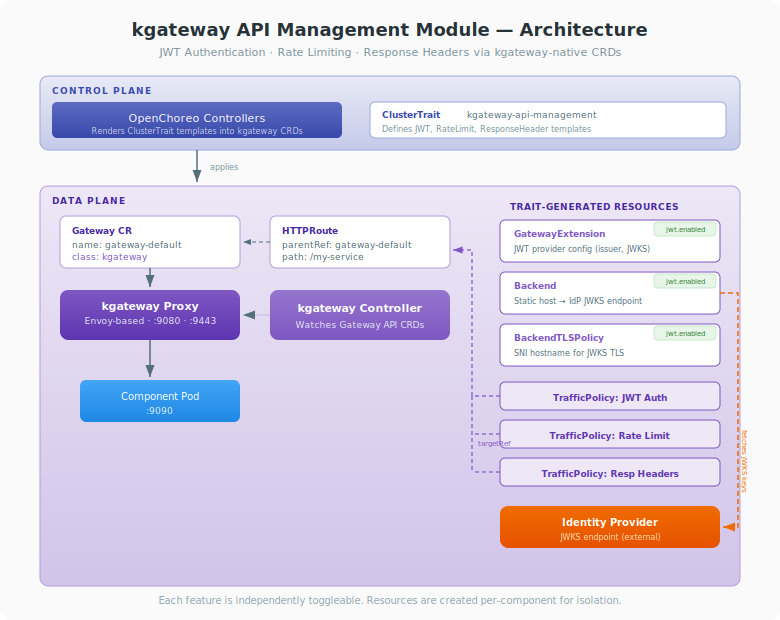

# kgateway API Management Module for OpenChoreo Data Plane

This module adds API management capabilities to OpenChoreo components using kgateway's native CRDs. It supports JWT authentication, local rate limiting, and response header modification — all configured declaratively via the `kgateway-api-management` ClusterTrait.

## Table of Contents

- [Overview](#overview)
- [Installation](#installation)
- [Trait Parameters](#trait-parameters)
- [Example Usage](#example-usage)
- [How It Works](#how-it-works)
- [Troubleshooting](#troubleshooting)

---

## Overview

kgateway is installed by default as part of the OpenChoreo data plane. It handles all Gateway API resources (Gateway, HTTPRoute) and routes traffic to component services. This module extends kgateway with API management policies by applying the `kgateway-api-management` ClusterTrait to components.

You only need this module if you want to add API management features (JWT auth, rate limiting, response headers) to your components using kgateway's native capabilities.



### Key Design Decisions

- **kgateway-native**: Uses kgateway's own CRDs (TrafficPolicy, GatewayExtension, Backend) — no external API management platform required.
- **No control plane changes**: kgateway is already installed with OpenChoreo. This module only adds a ClusterTrait and RBAC permissions.
- **JWT provider as infrastructure**: Identity provider configuration (issuer, JWKS URL) is set once in the trait YAML. Component authors only toggle `jwt.enabled: true/false`.
- **Per-component isolation**: Each component gets its own Backend, GatewayExtension, BackendTLSPolicy, and TrafficPolicy resources. Deleting one component does not affect others.
- **Per-route policies**: Each TrafficPolicy targets a specific HTTPRoute identified by the `endpointName` parameter.

---

## Installation

### Prerequisites

- An existing OpenChoreo deployment with the data plane installed (kgateway is included by default)
- kubectl configured with cluster access

### Step 1: Grant RBAC Permissions

The data plane service account needs permissions to manage kgateway API management resources. Create a ClusterRole and bind it to the data plane service account:

```bash
kubectl apply -f - <<EOF
apiVersion: rbac.authorization.k8s.io/v1
kind: ClusterRole
metadata:
  name: kgateway-api-management-module
rules:
  - apiGroups: ["gateway.kgateway.dev"]
    resources: ["trafficpolicies", "gatewayextensions", "backends"]
    verbs: ["*"]
  - apiGroups: ["gateway.networking.k8s.io"]
    resources: ["backendtlspolicies"]
    verbs: ["*"]
---
apiVersion: rbac.authorization.k8s.io/v1
kind: ClusterRoleBinding
metadata:
  name: kgateway-api-management-module
roleRef:
  apiGroup: rbac.authorization.k8s.io
  kind: ClusterRole
  name: kgateway-api-management-module
subjects:
  - kind: ServiceAccount
    name: cluster-agent-dataplane
    namespace: openchoreo-data-plane
EOF
```

> **Note:** Without these permissions, the Release controller will fail to apply TrafficPolicy, GatewayExtension, Backend, and BackendTLSPolicy resources to the data plane with a "forbidden" error.

### Step 2: Configure the JWT Identity Provider

If you plan to use JWT authentication, update the following fields in `kgateway-api-management-trait.yaml` with your identity provider's details before applying it. These values are configured once in the trait file and used by all JWT-enabled components.

**Fields to update:**

| Field (in trait template)                    | Description                              | Example                                           |
| -------------------------------------------- | ---------------------------------------- | ------------------------------------------------- |
| Backend `spec.static.hosts[0].host`          | JWKS endpoint hostname                   | `api.asgardeo.io`                                 |
| Backend `spec.static.hosts[0].port`          | JWKS endpoint port                       | `443`                                             |
| BackendTLSPolicy `validation.hostname`       | SNI hostname for TLS (must match Backend host) | `api.asgardeo.io`                            |
| GatewayExtension `issuer`                    | OIDC issuer URL                          | `https://api.asgardeo.io/t/lahirude/oauth2/token`   |
| GatewayExtension `jwks.remote.url`           | Full JWKS endpoint URL                   | `https://api.asgardeo.io/t/lahirude/oauth2/jwks`    |
| GatewayExtension `cacheDuration`             | How long to cache JWKS keys              | `5m`                                              |

> **Note:** You can configure multiple providers in the `providers` array if you need to support multiple identity providers. If you only need rate limiting or response headers (not JWT), you can skip this step.

### Step 3: Apply the ClusterTrait

```bash
kubectl apply -f kgateway-api-management-trait.yaml
```

### Step 4: Add to ComponentType

Add `kgateway-api-management` to the `allowedTraits` of the target ComponentType:

```bash
kubectl patch clustercomponenttype service --type='json' \
  -p='[{"op": "add", "path": "/spec/allowedTraits/-", "value": {"kind": "ClusterTrait", "name": "kgateway-api-management"}}]'
```

### Step 5: Verify

```bash
# Verify the ClusterTrait is registered
kubectl get clustertrait kgateway-api-management

# After deploying a component with the trait, verify resources are created
kubectl get trafficpolicy.gateway.kgateway.dev -n <data-plane-namespace> -o wide
kubectl get gatewayextension -n <data-plane-namespace>
kubectl get backend.gateway.kgateway.dev -n <data-plane-namespace>
kubectl get backendtlspolicy -n <data-plane-namespace>
```

All TrafficPolicies should show `ACCEPTED: True` and `ATTACHED: True`.

---

## Trait Parameters

| Parameter                     | Type    | Default | Required | Description                                                                       |
| ----------------------------- | ------- | ------- | -------- | --------------------------------------------------------------------------------- |
| `endpointName`                | string  | —       | **Yes**  | Workload endpoint name to target (must match a key in the Workload's `endpoints`) |
| `jwt.enabled`                 | boolean | `false` | No       | Enable JWT authentication                                                         |
| `rateLimiting.enabled`        | boolean | `true`  | No       | Enable local rate limiting                                                        |
| `rateLimiting.maxTokens`      | integer | `60`    | No       | Maximum number of tokens in the bucket                                            |
| `rateLimiting.tokensPerFill`  | integer | `60`    | No       | Number of tokens added per refill                                                 |
| `rateLimiting.fillInterval`   | string  | `"60s"` | No       | Interval between refills (e.g., `"60s"`, `"1m"`)                                  |
| `addResponseHeaders.enabled`  | boolean | `false` | No       | Enable response header modification                                               |
| `addResponseHeaders.headers`  | array   | `[]`    | No       | Headers to add to responses (each with `name` and `value`)                        |

---

## Example Usage

### JWT Authentication Only

```yaml
apiVersion: openchoreo.dev/v1alpha1
kind: Component
metadata:
  name: my-service
  namespace: default
spec:
  owner:
    projectName: default
  autoDeploy: true
  componentType:
    kind: ClusterComponentType
    name: deployment/service
  traits:
    - name: kgateway-api-management
      instanceName: my-api
      kind: ClusterTrait
      parameters:
        endpointName: http
        jwt:
          enabled: true
        rateLimiting:
          enabled: false
```

### Rate Limiting with Custom Values

```yaml
traits:
  - name: kgateway-api-management
    instanceName: my-api
    kind: ClusterTrait
    parameters:
      endpointName: http
      rateLimiting:
        enabled: true
        maxTokens: 100
        tokensPerFill: 100
        fillInterval: "30s"
```

### All Features Enabled

```yaml
traits:
  - name: kgateway-api-management
    instanceName: my-api
    kind: ClusterTrait
    parameters:
      endpointName: http
      jwt:
        enabled: true
      rateLimiting:
        enabled: true
        maxTokens: 100
        tokensPerFill: 50
        fillInterval: "60s"
      addResponseHeaders:
        enabled: true
        headers:
          - name: X-Powered-By
            value: OpenChoreo
          - name: X-Gateway
            value: kgateway
```

---

## How It Works

The trait uses OpenChoreo's template rendering pipeline to create kgateway resources in the component's data plane namespace. Each feature creates its own set of resources:

### JWT Authentication (`jwt.enabled: true`)

Creates four resources:

1. **Backend** — A `Static` backend pointing to the IdP's JWKS endpoint so kgateway can fetch JWT signing keys.
2. **BackendTLSPolicy** — Sets the SNI hostname for the TLS connection to the JWKS endpoint. Required for IdPs behind CDN/WAF that need SNI to route requests correctly.
3. **GatewayExtension** — Defines the JWT provider configuration (issuer, JWKS source, claim-to-header mappings).
4. **TrafficPolicy** — Attaches JWT validation to the component's HTTPRoute via `targetRefs`.

### Rate Limiting (`rateLimiting.enabled: true`)

Creates one resource:

- **TrafficPolicy** — Applies local token-bucket rate limiting to the component's HTTPRoute. Requests exceeding the limit receive a `429 Too Many Requests` response.

### Response Headers (`addResponseHeaders.enabled: true`)

Creates one resource:

- **TrafficPolicy** — Adds custom headers to every response sent back to the client.

### Resource Naming

All resources are named using `${metadata.name}-${trait.instanceName}-<suffix>` to ensure per-component isolation. The TrafficPolicy `targetRefs` use `oc_generate_name(metadata.componentName, parameters.endpointName)` to match the HTTPRoute name generated by the ComponentType.

---

## Troubleshooting

### TrafficPolicies not showing ACCEPTED/ATTACHED

```bash
# Check TrafficPolicy status
kubectl get trafficpolicy.gateway.kgateway.dev -n <data-plane-namespace> -o wide

# Check kgateway controller logs for errors
kubectl logs -n openchoreo-control-plane -l app.kubernetes.io/name=kgateway --tail=50 | grep -i error
```

Common causes:

- GatewayExtension or Backend not yet created (check Release controller logs).
- HTTPRoute name mismatch — ensure `endpointName` matches a key in the Workload's `endpoints`.
- Missing RBAC permissions (see Step 1).

### JWT returns "Jwks remote fetch is failed"

The JWKS endpoint is reachable but returning an error. Enable debug logging on the gateway to diagnose:

```bash
# Check the response status code in gateway logs
kubectl logs -n openchoreo-data-plane -l app.kubernetes.io/name=gateway-default --tail=100 | grep -i "status code"
```

Common causes:

- Missing `BackendTLSPolicy` — the IdP's CDN/WAF requires SNI to route requests. Ensure the BackendTLSPolicy `hostname` matches the Backend host.
- Incorrect JWKS URL or issuer in the GatewayExtension template.

### JWT returns "Jwt is missing"

This is expected behavior — the JWT TrafficPolicy is enforcing authentication and no `Authorization: Bearer <token>` header was provided in the request.

### Removing the Module

To remove the API management module:

1. Remove the `kgateway-api-management` trait from all Components.
2. Delete the ClusterTrait:
   ```bash
   kubectl delete clustertrait kgateway-api-management
   ```
3. Remove RBAC:
   ```bash
   kubectl delete clusterrole kgateway-api-management-module
   kubectl delete clusterrolebinding kgateway-api-management-module
   ```
4. Remove from ComponentType's `allowedTraits`:
   ```bash
   kubectl patch clustercomponenttype service --type='json' \
     -p='[{"op": "remove", "path": "/spec/allowedTraits/2"}]'
   ```

> **Note:** kgateway itself is part of the OpenChoreo data plane and should not be removed.
