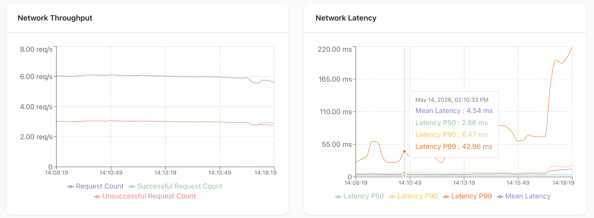
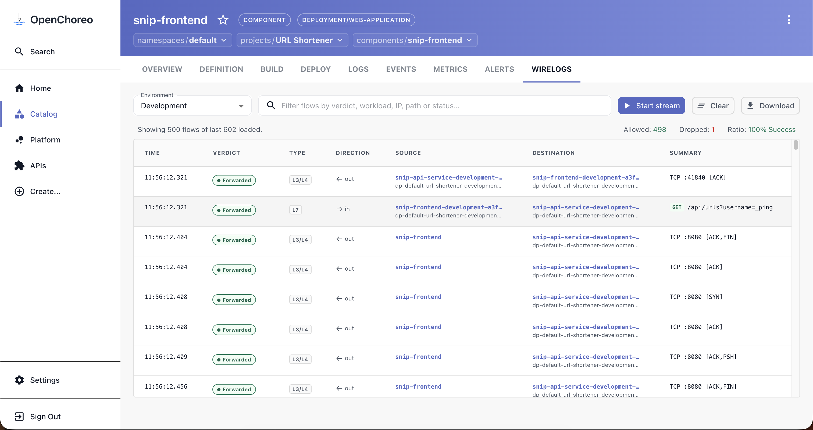
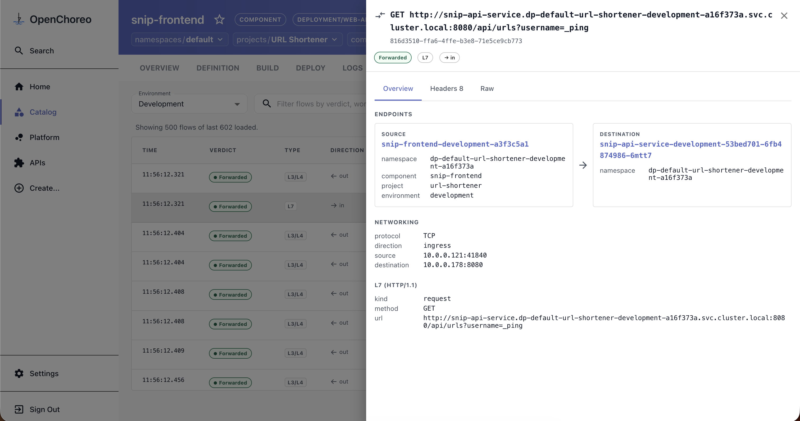

# Networking Module with Cilium

This module enables advanced network security and observability in OpenChoreo using [Cilium](https://cilium.io/).

## Features

### Advanced network security

- Project boundary isolation in runtime using `CiliumNetworkPolicies`
- Egress control based on FQDN, HTTP paths, etc (Coming Soon)

### Advanced network observability

- HTTP throughput and latency metrics
  

- Cell Diagram runtime observability
  

- Network wirelogs
  
  

## Prerequisites

- [Cilium](https://cilium.io/) must be installed on the dataplane Kubernetes clusters and configured as the Container Network Interface (CNI) plugin.
- [OpenChoreo](https://openchoreo.dev) must be installed with the **observability plane** enabled and with [observability-metrics-prometheus](https://github.com/openchoreo/community-modules/tree/main/observability-metrics-prometheus) community module installed if you want network observability.

## Configuration

1. After the prerequisites are met, configure your Cilium installation in the dataplane Kubernetes cluster with the following values to enable HTTP metrics observability.

   Example using Helm:

   ```bash
   helm upgrade --install cilium oci://quay.io/cilium/charts/cilium \
     --version 1.19.4 \
     --namespace kube-system \
     --reuse-values \
     -f - <<EOF
   hubble:
     enabled: true
     metrics:
       enabled:
         - "httpV2:exemplars=true;labelsContext=source_ip,source_namespace,source_workload,destination_ip,destination_namespace,destination_workload,traffic_direction,source_pod,destination_pod"
         - dns
         - drop
         - tcp
       serviceMonitor:
         enabled: true
     relay:
       enabled: true

   envoy:
     enabled: true
   EOF
   ```

   Example using Cilium CLI:

   ```bash
   cilium upgrade \
   --version 1.19.4 \
   --namespace kube-system \
   --reuse-values \
   --helm-set hubble.enabled=true \
   --helm-set hubble.metrics.enabled="{httpV2:exemplars=true;labelsContext=source_ip\,source_namespace\,source_workload\,destination_ip\,destination_namespace\,destination_workload\,traffic_direction\,source_pod\,destination_pod,dns,drop,tcp}" \
   --helm-set hubble.metrics.serviceMonitor.enabled=true \
   --helm-set hubble.relay.enabled=true \
   --helm-set envoy.enabled=true
   ```

2. Add the annotation `openchoreo.dev/networkpolicyprovider: cilium` to the `DataPlane` or `ClusterDataPlane` resources which points to the kubernetes cluster with Cilium configured.

Example:

```bash
kubectl annotate clusterdataplanes.openchoreo.dev default openchoreo.dev/networkpolicyprovider=cilium --overwrite
```

3. Add `HUBBLE_RELAY_ADDR` environment variable to OpenChoreo Cluster Agent system component to query from hubble relay.

Example:

```bash
helm upgrade --install openchoreo-data-plane oci://ghcr.io/openchoreo/helm-charts/openchoreo-data-plane \
  --version 1.2.0 \
  --namespace openchoreo-data-plane \
  --create-namespace \
  --reuse-values \
  --set "clusterAgent.extraEnvs[0].name=HUBBLE_RELAY_ADDR" \
  --set "clusterAgent.extraEnvs[0].value=hubble-relay.kube-system:80"
```

## Verification

Verify that the annotation has correctly been set in the `DataPlane`/`ClusterDataPlane` resources.

Example:

```bash
kubectl describe clusterdataplanes.openchoreo.dev default | grep "openchoreo.dev/networkpolicyprovider"
```

Verify if `CiliumNetworkPolicy` resources are generated instead of `NetworkPolicy` resources in dataplane cluster

Example:

```bash
kubectl get ciliumnetworkpolicies.cilium.io -A
```

## Compatibility

This module integrates Cilium, OpenChoreo, and observability-metrics-prometheus (an OpenChoreo community module), and is compatible with the following versions.

| Component                            | Compatible Version | Notes                         |
| :----------------------------------- | :----------------- | :---------------------------- |
| **Cilium**                           | `1.19.x`           |                               |
| **OpenChoreo**                       | `>=1.1.x`          | Requires `1.2.x` for Wirelogs |
| **Observability-Metrics-Prometheus** | `0.6.x`            | OpenChoreo community module   |
