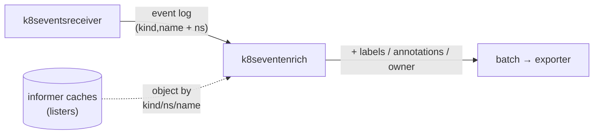

# Kubernetes Event Enrichment Processor

The `k8seventenrich` processor enriches Kubernetes **events** with metadata of
the object that triggered the event (the event's _involved object_) — its
**labels**, **annotations**, and **controlling owner reference**.

It is designed to sit downstream of the
[`k8seventsreceiver`](https://github.com/open-telemetry/opentelemetry-collector-contrib/tree/main/receiver/k8seventsreceiver),
which emits each Kubernetes event as a log record. Events are fired by many kinds
of objects (Pods, Deployments, Jobs, …), so — unlike container logs — they cannot
be enriched with workload metadata by pod-association alone. This processor closes
that gap: it keeps cluster-wide in-memory caches of workload objects and, for each
event, looks up the involved object and copies its metadata onto the event.

Enriched keys are written onto the log **resource** attributes:

| Source      | Attribute keys                     |
| ----------- | ---------------------------------- |
| Labels      | `k8s.object.label.<key>`           |
| Annotations | `k8s.object.annotation.<key>`      |
| Owner ref   | `k8s.object.owner.{kind,name,uid}` |

All attribute key prefixes are configurable. Each source can be enabled and filtered
independently. Enrichment is served entirely from in-memory informer caches, so
it adds **no API-server calls and no latency on the event path**.

## How it works

The `k8seventsreceiver` splits the involved object's identity across two
attribute levels. This processor reads from both:

| Attribute            | Level      | Used as          |
| -------------------- | ---------- | ---------------- |
| `k8s.object.kind`    | resource   | lookup kind      |
| `k8s.object.name`    | resource   | lookup name      |
| `k8s.namespace.name` | log record | lookup namespace |

The lookup key is `(kind, namespace, name)`. The kind is matched
case-insensitively against the [watched-kinds registry](#watched-kinds). On a
cache hit, the object's metadata (after [filtering](#configuration)) is written
onto the resource attributes under the configured prefixes.



Enrichment is **best-effort**. An event passes through unchanged when:

- its kind is not in the watched-kinds registry (e.g. `Node`, `Namespace`, a CRD),
- the involved object is cluster-scoped (no namespace), or
- the object is not present in cache (deleted, or not yet synced).

## Configuration

Each metadata source (`labels`, `annotations`, `owner_references`) is a
self-contained block, so they can be enabled and filtered independently. All
fields are optional; the defaults below are applied when a block — or the whole
processor config — is omitted.

```yaml
processors:
  k8seventenrich:
    resync_period: 10m
    cache_sync_timeout: 2m
    labels:
      enabled: true
      prefix: "k8s.object.label."
      include: [] # allow-list; empty = all keys
      exclude: [] # deny-list;
    annotations:
      enabled: false # opt-in: annotations may be noisy and sensitive
      prefix: "k8s.object.annotation."
      include: []
      exclude: ["kubectl.kubernetes.io/last-applied-configuration"]
    owner_references:
      enabled: true
      prefix: "k8s.object.owner."
```

| Option               | Type     | Default      | Description                                                                                                                                                                                                                      |
| -------------------- | -------- | ------------ | -------------------------------------------------------------------------------------------------------------------------------------------------------------------------------------------------------------------------------- |
| `resync_period`      | duration | `10m`        | How often the informer caches are fully re-listed against the API server. `0` disables periodic resync and relies on the watch stream alone.                                                                                     |
| `cache_sync_timeout` | duration | `2m`         | How long `Start` waits for informer caches to warm up before failing. Must be positive. A missing RBAC grant otherwise hangs startup forever; the timeout makes it crash-loop with a clear error. Raise for large/slow clusters. |
| `labels`             | block    | enabled      | Enrichment from the involved object's labels. See _Field options_.                                                                                                                                                               |
| `annotations`        | block    | **disabled** | Enrichment from the involved object's annotations (noisy and possibly sensitive — opt in). See _Field options_.                                                                                                                  |
| `owner_references`   | block    | enabled      | Enrichment from the involved object's controlling owner reference. See _Owner options_.                                                                                                                                          |

**Field options** (`labels`, `annotations`):

| Option    | Type     | Default                                                 | Description                                                                                                                  |
| --------- | -------- | ------------------------------------------------------- | ---------------------------------------------------------------------------------------------------------------------------- |
| `enabled` | bool     | labels `true`, annotations `false`                      | Turn this source on or off.                                                                                                  |
| `prefix`  | string   | per-source (see above)                                  | Prefix prepended to each copied key. Must not be empty when enabled.                                                         |
| `include` | []string | `[]`                                                    | If non-empty, only these keys are copied. Empty means copy all.                                                              |
| `exclude` | []string | labels `[]`, annotations `[last-applied-configuration]` | Keys never copied, applied even when `include` is empty. **Setting this in config replaces the default — it is not merged.** |

**Owner options** (`owner_references`):

| Option    | Type   | Default             | Description                                      |
| --------- | ------ | ------------------- | ------------------------------------------------ |
| `enabled` | bool   | `true`              | Turn owner-reference enrichment on or off.       |
| `prefix`  | string | `k8s.object.owner.` | Prefix for the emitted `kind`/`name`/`uid` keys. |

Only the **controlling** owner reference (`controller: true`) is emitted; if the
object has no controlling owner, no owner attributes are added.

Filtering precedence (labels/annotations): a key is copied when it is **not** in
`exclude` **and** (`include` is empty **or** the key is in `include`).

### Example 1: Default enrichment

Copy all labels plus the controller owner. Annotations are off by default.

```yaml
processors:
  k8seventenrich: {}
```

### Example 2: Selected set of labels and annotations

```yaml
processors:
  k8seventenrich:
    labels:
      include:
        - openchoreo.dev/component
        - openchoreo.dev/project
        - openchoreo.dev/environment
    annotations:
      enabled: true # off by default; enable explicitly
      include:
        - prometheus.io/scrape
```

### Example 3: All labels except churny ones

```yaml
processors:
  k8seventenrich:
    labels:
      exclude:
        - pod-template-hash
        - controller-revision-hash
```

### Example 4: Full events pipeline with OpenSearch as storage

```yaml
receivers:
  k8s_events:
    auth_type: serviceAccount

processors:
  k8seventenrich: {}
  batch:

exporters:
  opensearch:
    logs_index: "k8s-events"
    logs_index_time_format: "yyyy-MM-dd"
    http:
      endpoint: "https://opensearch-cluster:9200"

service:
  pipelines:
    logs:
      receivers: [k8s_events]
      processors: [k8seventenrich, batch]
      exporters: [opensearch]
```

## Watched kinds

The processor maintains one cluster-wide informer per kind below. The key is the
lowercased value the receiver places in `k8s.object.kind`.

| Kind          | API group / version | Lister       |
| ------------- | ------------------- | ------------ |
| `Pod`         | core/v1             | Pods         |
| `Service`     | core/v1             | Services     |
| `Deployment`  | apps/v1             | Deployments  |
| `ReplicaSet`  | apps/v1             | ReplicaSets  |
| `StatefulSet` | apps/v1             | StatefulSets |
| `DaemonSet`   | apps/v1             | DaemonSets   |
| `Job`         | batch/v1            | Jobs         |
| `CronJob`     | batch/v1            | CronJobs     |

### Adding a kind

Watched kinds are registered in `registerKindGetters` (`kinds.go`). Adding one
today requires a code change: declare the lister, add a map entry keyed by the
**lowercased** kind, grant the matching RBAC, and rebuild the collector. For
example, to also enrich `Endpoints` events:

```go
endpoints := f.Core().V1().Endpoints().Lister()
// ...
"endpoints": func(ns, n string) (metav1.Object, error) { return endpoints.Endpoints(ns).Get(n) },
```

> Only **namespaced** kinds are supported at the moment, because the lookup requires a namespace. Cluster-scoped kinds (Node, PersistentVolume, …) are skipped.

> **Planned:** dynamic registration of arbitrary kinds (e.g. via config), so new
> kinds no longer require editing `kinds.go` and rebuilding

## RBAC

The processor uses the pod's service account (`rest.InClusterConfig()`) and needs
cluster-wide `get`/`list`/`watch` on every watched kind. The `k8seventsreceiver`
additionally needs access to `events`.

```yaml
apiVersion: v1
kind: ServiceAccount
metadata:
  name: otel-events-collector
  namespace: observability
---
apiVersion: rbac.authorization.k8s.io/v1
kind: ClusterRole
metadata:
  name: otel-events-collector
rules:
  - apiGroups: [""]
    resources: ["events", "namespaces", "pods", "services"]
    verbs: ["get", "list", "watch"]
  - apiGroups: ["apps"]
    resources: ["deployments", "replicasets", "statefulsets", "daemonsets"]
    verbs: ["get", "list", "watch"]
  - apiGroups: ["batch"]
    resources: ["jobs", "cronjobs"]
    verbs: ["get", "list", "watch"]
---
apiVersion: rbac.authorization.k8s.io/v1
kind: ClusterRoleBinding
metadata:
  name: otel-events-collector
roleRef:
  apiGroup: rbac.authorization.k8s.io
  kind: ClusterRole
  name: otel-events-collector
subjects:
  - kind: ServiceAccount
    name: otel-events-collector
    namespace: observability
```

## Lifecycle

- On `Start`, the processor builds a Kubernetes clientset, registers the
  informers, starts the watches, and blocks on `WaitForCacheSync`. Enrichment
  begins only after every cache is warm; a sync failure fails startup.
- On `Shutdown`, the informer watches are stopped.

## Caveats

- **Single instance.** The `k8seventsreceiver` is not horizontally scalable, and
  the caches assume one collector owns the event stream. Run a single replica.
  (Active/standby failover is possible with the `k8s_leader_elector` extension,
  but it is not bundled in this distribution — add it to `builder-config.yaml`
  and rebuild to use it.)
- **In-cluster only.** Credentials come from `rest.InClusterConfig()`; there is
  no kubeconfig / out-of-cluster run path.
- **Memory.** Caches hold _all_ objects of _all_ watched kinds cluster-wide.
  Memory scales with cluster size; trim watched kinds in `kinds.go` if needed.
- **Cluster-scoped involved objects are not enriched** (no namespace to key on).

## Compatibility

- OpenTelemetry Collector **v0.153.0** (stable core modules v1.59.0).
- Built with `client-go` v0.36 (Kubernetes 1.36), which requires **Go 1.26+**.

## Roadmap

- Dynamic registration of arbitrary watched kinds via config, so new kinds no
  longer require editing `kinds.go` and rebuilding (see [Adding a kind](#adding-a-kind)).
- Optional UID-based de-duplication of in-session `count` updates;
  restart-replay dedup is already handled by the receiver's `storage` extension
  without code.
- Owner-chain resolution to the root controller (Pod → ReplicaSet → Deployment)
  for rolling events up to the owning workload.
