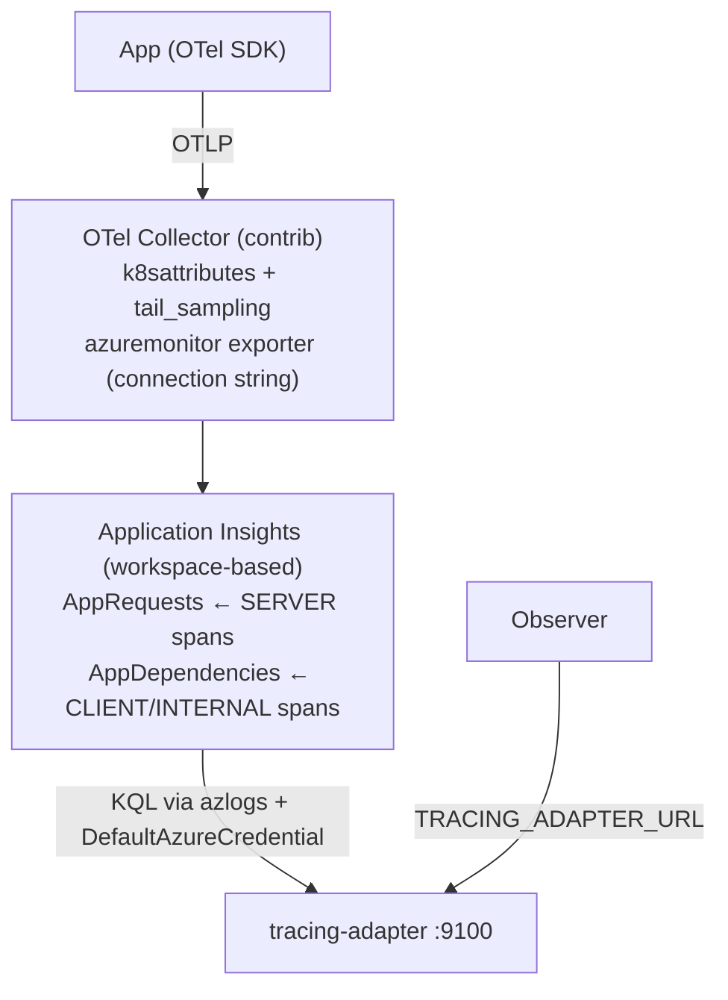

# Observability Tracing Module for Azure Application Insights

This module collects distributed traces using [OpenTelemetry collector](https://opentelemetry.io) and stores them in [Azure Application Insights](https://learn.microsoft.com/azure/azure-monitor/app/app-insights-overview).

Spans are exported to a workspace-based Application Insights resource. An adapter implements the OpenChoreo Observability Tracing Adapter API and answers Observer trace queries by running KQL against the backing Log Analytics workspace.



## Prerequisites

- [OpenChoreo](https://openchoreo.dev) must be installed with the **observability plane** enabled for this module to work. Deploy the `openchoreo-observability-plane` helm chart with the helm value `observer.tracingAdapter.enabled="true"` to enable the observer to fetch data from this tracing module.

### Azure prerequisites

The commands below assume `az` is logged in (`az login`) and a few shared
variables are exported:

```bash
RG="<your-resource-group>"
LOCATION="eastus2"
AKS_NAME="<your-aks-cluster>"
WORKSPACE_NAME="<your-log-analytics-workspace>"
APPINSIGHTS_NAME="<your-application-insights>"
```

#### Azure subscription and region

List your subscriptions, select the target one, and pick a region:

```bash
az account list --query "[].{name:name, id:id}" -o table

SUBSCRIPTION_ID="<your-subscription-id>"
az account set --subscription "$SUBSCRIPTION_ID"

az account show --query "{name:name, id:id}" -o table   # confirm the active subscription
az account list-locations --query "[].name" -o tsv      # list valid regions
```

#### AKS cluster with OIDC issuer and Workload Identity

Enable both on an existing cluster (or pass the same flags to
`az aks create`):

```bash
az aks update -g "$RG" -n "$AKS_NAME" \
  --enable-oidc-issuer \
  --enable-workload-identity
```

Verify they are on:

```bash
az aks show -g "$RG" -n "$AKS_NAME" \
  --query "{oidc:oidcIssuerProfile.enabled, wi:securityProfile.workloadIdentity.enabled}" -o table
```

#### Log Analytics workspace (Analytics table plan)

Create a workspace (Analytics is the default plan) and capture its
resource ID:

```bash
az monitor log-analytics workspace create \
  -g "$RG" -n "$WORKSPACE_NAME" -l "$LOCATION"

WORKSPACE_ARM_ID=$(az monitor log-analytics workspace show \
  -g "$RG" -n "$WORKSPACE_NAME" --query id -o tsv)

WORKSPACE_CUSTOMER_ID=$(az monitor log-analytics workspace show \
  -g "$RG" -n "$WORKSPACE_NAME" --query customerId -o tsv)
```

`WORKSPACE_CUSTOMER_ID` is the workspace `customerId` (a GUID) the adapter
queries by; `WORKSPACE_ARM_ID` is the full resource ID Application Insights
binds to below.

#### Workspace-based Application Insights resource

Create an Application Insights resource pointed at that workspace, and
capture its connection string (used by the collector's `azuremonitor`
exporter):

```bash
az monitor app-insights component create \
  --app "$APPINSIGHTS_NAME" -g "$RG" -l "$LOCATION" \
  --workspace "$WORKSPACE_ARM_ID"

APPINSIGHTS_CONNECTION_STRING=$(az monitor app-insights component show \
  --app "$APPINSIGHTS_NAME" -g "$RG" --query connectionString -o tsv)
```

#### Application Insights connection-string Secret

Create a Kubernetes Secret with the connection string in each cluster that
runs a collector (see [Deployment topologies](#deployment-topologies)):

```bash
az aks get-credentials -g "$RG" -n "$AKS_NAME"   # for the kubectl step below

kubectl create secret generic appinsights-conn \
  --namespace openchoreo-observability-plane \
  --from-literal=connection-string="$APPINSIGHTS_CONNECTION_STRING"
```

#### User-Assigned Managed Identity

A **User-Assigned Managed Identity** with the **Log Analytics Reader** role
on the workspace, used by the adapter (query side), and federated to the
`tracing-adapter-azure-appinsights` ServiceAccount. Create it and capture
its `clientId`:

```bash
az identity create -g "$RG" -n "<uami-name>" -l "$LOCATION"

UAMI_CLIENT_ID=$(az identity show \
  -g "$RG" -n "<uami-name>" --query clientId -o tsv)
```

Pass `UAMI_CLIENT_ID` through `adapter.serviceAccount.annotations` at install
time (see [Installation](#installation)).

## Installation

### Deployment topologies

Every OpenTelemetry Collector in this module exports directly to Application Insights through the `azuremonitor` exporter. There is no inter-collector relay: a collector running in a data-plane cluster writes spans straight to the shared Application Insights resource, the same way the X-Ray module writes directly to AWS X-Ray. Pick the topology by toggling which workloads the chart deploys.

| Topology | Install location | Deploys | Required Helm values |
| --- | --- | --- | --- |
| Single cluster | The cluster where the observability plane and workloads run together. | Collector and adapter. | Defaults. |
| Observability plane cluster | The cluster where the observability plane is installed. | Adapter only. | `opentelemetry-collector.enabled=false` |
| Data-plane cluster | Each cluster that runs OpenChoreo workloads. | Collector only. | `adapter.enabled=false` |

Application Insights is the shared managed backend. Each collector needs the `appinsights-conn` secret (connection string) in its own cluster, since it writes to Application Insights directly. The observability-plane adapter reads back from the Log Analytics workspace. Remote workload clusters do not need network connectivity to the observability plane.

#### Single cluster

Install the chart into the observability plane cluster/namespace. This deploys both the collector and the adapter:

```bash
helm upgrade --install observability-tracing-azure-appinsights \
  oci://ghcr.io/openchoreo/helm-charts/observability-tracing-azure-appinsights \
  --create-namespace \
  --namespace openchoreo-observability-plane \
  --version 0.1.0 \
  --set logAnalytics.workspaceId="<workspace customerId GUID>" \
  --set adapter.serviceAccount.annotations."azure\.workload\.identity/client-id"="<uami-client-id>"
```

`logAnalytics.workspaceId` is the workspace `customerId` (a GUID), not the ARM resource ID.

The collector gets the connection string from the `appinsights-conn` secret created in the prerequisites. The chart wires it through `opentelemetry-collector.extraEnvs`: the secret's `connection-string` key is mapped via `valueFrom.secretKeyRef` into the `APPINSIGHTS_CONNECTION_STRING` environment variable, which the `azuremonitor` exporter reads. To use a different secret name or key, update both fields under `opentelemetry-collector.extraEnvs` in `values.yaml`.

#### Multi-cluster

Install the chart once per cluster, deploying only the workload that cluster needs.

##### 1) Observability plane cluster (adapter only)

This cluster runs the adapter that serves Observer queries. The collector is disabled here:

```bash
helm upgrade --install observability-tracing-azure-appinsights \
  oci://ghcr.io/openchoreo/helm-charts/observability-tracing-azure-appinsights \
  --create-namespace \
  --namespace openchoreo-observability-plane \
  --version 0.1.0 \
  --set opentelemetry-collector.enabled=false \
  --set logAnalytics.workspaceId="<workspace customerId GUID>" \
  --set adapter.serviceAccount.annotations."azure\.workload\.identity/client-id"="<uami-client-id>"
```

##### 2) Data-plane cluster (collector only)

Install the chart in each data-plane cluster. The collector receives OTLP from in-cluster workloads, enriches spans with pod labels, and exports directly to Application Insights. The adapter is disabled here. Create the `appinsights-conn` secret in this cluster first (see the prerequisites):

```bash
helm upgrade --install observability-tracing-azure-appinsights \
  oci://ghcr.io/openchoreo/helm-charts/observability-tracing-azure-appinsights \
  --create-namespace \
  --namespace openchoreo-observability-plane \
  --version 0.1.0 \
  --set adapter.enabled=false
```

## Adapter configuration

The adapter is configured through these environment variables (set by the Helm chart):

| Variable | Required | Default | Purpose |
|---|---|---|---|
| `LOG_ANALYTICS_WORKSPACE_ID` | yes | — | workspace `customerId` (GUID) |
| `SERVER_PORT` | no | `9100` | listen port |
| `QUERY_TIMEOUT_SECONDS` | no | `30` | per-query KQL timeout |
| `LOG_LEVEL` | no | `INFO` | `DEBUG`, `INFO`, `WARN`, `ERROR` |

Credentials come from `azidentity.NewDefaultAzureCredential`: Workload Identity in-cluster, the `az` CLI locally.


## Behavior notes

- **Ingestion latency**: App Insights ingestion takes up to a few minutes; spans are not queryable immediately after being emitted.
- **Span kind fidelity**: App Insights stores spans in two tables; the adapter reports `SERVER` for `AppRequests` rows and `CLIENT` for `AppDependencies` rows. The original `CLIENT`/`PRODUCER`/`INTERNAL` distinction is not preserved by the exporter.
- **Root spans**: the `azuremonitor` exporter writes `ParentId == OperationId` for root spans; the adapter normalizes this to an empty `parentSpanId` in responses, matching the sibling adapters.
- **Durations**: App Insights stores `DurationMs` (float milliseconds); `durationNs` values are converted and carry no sub-100ns precision.
- **Attributes**: the exporter flattens resource and span attributes into one `Properties` bag; the adapter splits them back by key prefix (`openchoreo.dev/`, `k8s.`, `service.`, ... are reported as resource attributes).

## Compatibility

> **Note:** The Helm chart versions specified in the installation commands above are for the latest module version compatible with the development version of OpenChoreo. Refer to the compatibility table below to determine the appropriate module version for your OpenChoreo installation.

| Module Version | OpenChoreo Version |
|----------------|--------------------|
| v0.1.x         | v1.2.x             |
