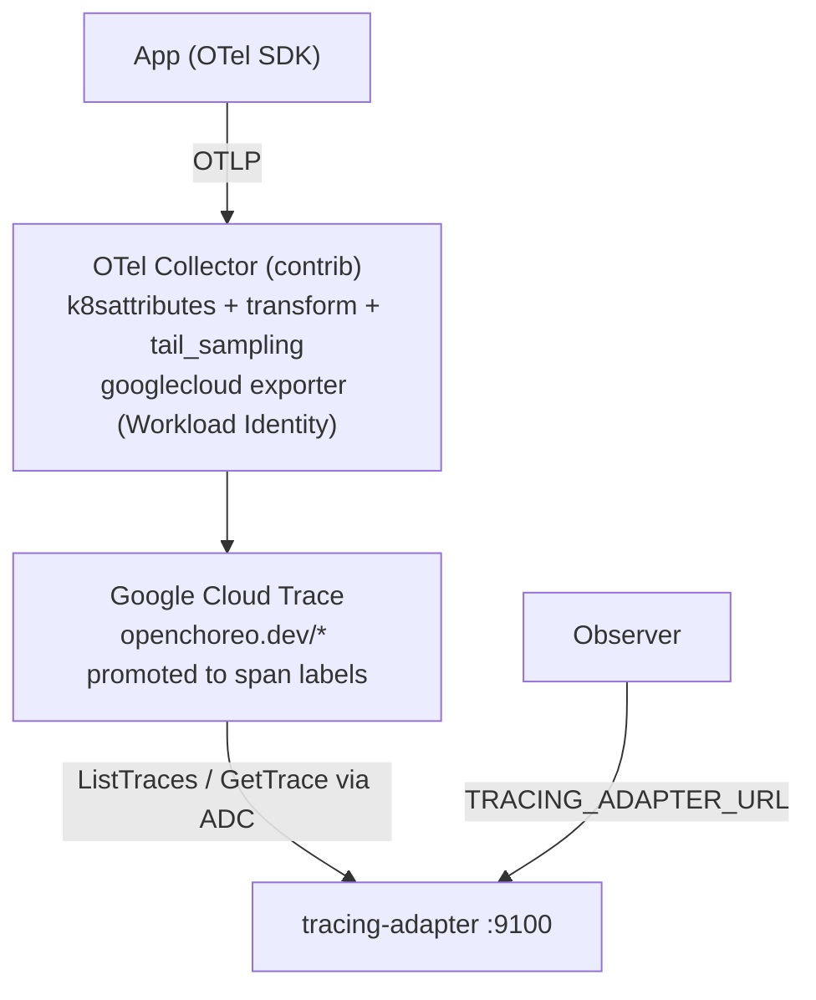

# Observability Tracing Module for Google Cloud Trace

This module collects distributed traces using [OpenTelemetry collector](https://opentelemetry.io) and stores them in [Google Cloud Trace](https://cloud.google.com/trace).

Spans are exported to Cloud Trace through the collector's `googlecloud` exporter. An adapter implements the OpenChoreo Observability Tracing Adapter API and answers Observer trace queries through the Cloud Trace v1 read API (`ListTraces` / `GetTrace`).



The collector promotes the four OpenChoreo pod labels (`openchoreo.dev/namespace`, `openchoreo.dev/component-uid`, `openchoreo.dev/project-uid`, `openchoreo.dev/environment-uid`) from resource attributes to **span attributes**. This step is load-bearing: the `googlecloud` exporter does not write resource attributes onto Cloud Trace spans, and the adapter scopes every query with exact-match label filters such as `+openchoreo.dev/namespace:default +openchoreo.dev/component-uid:<uid>`.

## Prerequisites

- [OpenChoreo](https://openchoreo.dev) must be installed with the **observability plane** enabled for this module to work. Deploy the `openchoreo-observability-plane` helm chart with the helm value `observer.tracingAdapter.enabled="true"` to enable the observer to fetch data from this tracing module.

### GCP prerequisites

The commands below assume `gcloud` is logged in (`gcloud auth login`) and a few
shared variables are exported:

```bash
PROJECT_ID="<your-gcp-project>"
CLUSTER="<your-gke-cluster>"
ZONE="<your-cluster-zone>"
NS="openchoreo-observability-plane"
```

#### Cloud Trace API

Enable the Cloud Trace API on the project:

```bash
gcloud services enable cloudtrace.googleapis.com --project "$PROJECT_ID"
```

#### GKE cluster with Workload Identity

Enable Workload Identity on the cluster and `GKE_METADATA` on its node pools
(or pass the same flags to `gcloud container clusters create`):

```bash
gcloud container clusters update "$CLUSTER" --zone "$ZONE" \
  --workload-pool="${PROJECT_ID}.svc.id.goog"

gcloud container node-pools update "<pool-name>" --cluster "$CLUSTER" --zone "$ZONE" \
  --workload-metadata=GKE_METADATA
```

#### Google Service Accounts and IAM roles

Two identities are needed (one GSA holding both roles also works):

| Component | Role | Purpose |
|---|---|---|
| Adapter | `roles/cloudtrace.user` | read traces (`cloudtrace.traces.list` / `cloudtrace.traces.get`) |
| Collector | `roles/cloudtrace.agent` | write spans (`cloudtrace.traces.patch`, `telemetry.traces.write`) |

Create the adapter GSA (query side) and federate it to the
`tracing-adapter-gcp-cloudtrace` ServiceAccount:

```bash
gcloud iam service-accounts create tracing-adapter-cloudtrace --project "$PROJECT_ID"

gcloud projects add-iam-policy-binding "$PROJECT_ID" \
  --member "serviceAccount:tracing-adapter-cloudtrace@${PROJECT_ID}.iam.gserviceaccount.com" \
  --role roles/cloudtrace.user

gcloud iam service-accounts add-iam-policy-binding \
  "tracing-adapter-cloudtrace@${PROJECT_ID}.iam.gserviceaccount.com" \
  --role roles/iam.workloadIdentityUser \
  --member "serviceAccount:${PROJECT_ID}.svc.id.goog[${NS}/tracing-adapter-gcp-cloudtrace]"
```

Create the collector GSA (ingest side) and federate it to the
`otel-collector-gcp` ServiceAccount — repeat the workload-identity binding for
each cluster that runs a collector (see
[Deployment topologies](#deployment-topologies)):

```bash
gcloud iam service-accounts create otel-collector-cloudtrace --project "$PROJECT_ID"

gcloud projects add-iam-policy-binding "$PROJECT_ID" \
  --member "serviceAccount:otel-collector-cloudtrace@${PROJECT_ID}.iam.gserviceaccount.com" \
  --role roles/cloudtrace.agent

gcloud iam service-accounts add-iam-policy-binding \
  "otel-collector-cloudtrace@${PROJECT_ID}.iam.gserviceaccount.com" \
  --role roles/iam.workloadIdentityUser \
  --member "serviceAccount:${PROJECT_ID}.svc.id.goog[${NS}/otel-collector-gcp]"
```

Both components authenticate with Application Default Credentials — no key
files. On non-GKE clusters that cannot use Workload Identity, mount a static
service-account key and set `GOOGLE_APPLICATION_CREDENTIALS`.

## Installation

### Deployment topologies

Every OpenTelemetry Collector in this module exports directly to Cloud Trace through the `googlecloud` exporter. There is no inter-collector relay: a collector running in a data-plane cluster writes spans straight to the shared GCP project, the same way the X-Ray module writes directly to AWS X-Ray. Pick the topology by toggling which workloads the chart deploys.

| Topology | Install location | Deploys | Required Helm values |
| --- | --- | --- | --- |
| Single cluster | The cluster where the observability plane and workloads run together. | Collector and adapter. | Defaults. |
| Observability plane cluster | The cluster where the observability plane is installed. | Adapter only. | `opentelemetry-collector.enabled=false` |
| Data-plane cluster | Each cluster that runs OpenChoreo workloads. | Collector only. | `adapter.enabled=false` |

Cloud Trace is the shared managed backend. Each collector needs its ServiceAccount bound to a GSA with `roles/cloudtrace.agent` in its own cluster, since it writes to Cloud Trace directly. The observability-plane adapter reads back through the Cloud Trace v1 API. Remote workload clusters do not need network connectivity to the observability plane.

#### Single cluster

Install the chart into the observability plane cluster/namespace. This deploys both the collector and the adapter:

```bash
helm upgrade --install observability-tracing-gcp-cloudtrace \
  oci://ghcr.io/openchoreo/helm-charts/observability-tracing-gcp-cloudtrace \
  --create-namespace \
  --namespace openchoreo-observability-plane \
  --version 0.1.0 \
  --set gcp.projectId="$PROJECT_ID" \
  --set adapter.serviceAccount.annotations."iam\.gke\.io/gcp-service-account"="tracing-adapter-cloudtrace@${PROJECT_ID}.iam.gserviceaccount.com" \
  --set opentelemetry-collector.serviceAccount.annotations."iam\.gke\.io/gcp-service-account"="otel-collector-cloudtrace@${PROJECT_ID}.iam.gserviceaccount.com"
```

Workloads send OTLP spans to the collector service (`otel-collector-gcp:4317` gRPC / `:4318` HTTP).

#### Multi-cluster

Install the chart once per cluster, deploying only the workload that cluster needs.

##### 1) Observability plane cluster (adapter only)

This cluster runs the adapter that serves Observer queries. The collector is disabled here:

```bash
helm upgrade --install observability-tracing-gcp-cloudtrace \
  oci://ghcr.io/openchoreo/helm-charts/observability-tracing-gcp-cloudtrace \
  --create-namespace \
  --namespace openchoreo-observability-plane \
  --version 0.1.0 \
  --set opentelemetry-collector.enabled=false \
  --set gcp.projectId="$PROJECT_ID" \
  --set adapter.serviceAccount.annotations."iam\.gke\.io/gcp-service-account"="tracing-adapter-cloudtrace@${PROJECT_ID}.iam.gserviceaccount.com"
```

##### 2) Data-plane cluster (collector only)

Install the chart in each data-plane cluster. The collector receives OTLP from in-cluster workloads, enriches spans with pod labels, and exports directly to Cloud Trace. The adapter is disabled here. Bind the collector GSA to this cluster's ServiceAccount first (see the prerequisites):

```bash
helm upgrade --install observability-tracing-gcp-cloudtrace \
  oci://ghcr.io/openchoreo/helm-charts/observability-tracing-gcp-cloudtrace \
  --create-namespace \
  --namespace openchoreo-observability-plane \
  --version 0.1.0 \
  --set adapter.enabled=false \
  --set gcp.projectId="$PROJECT_ID" \
  --set opentelemetry-collector.serviceAccount.annotations."iam\.gke\.io/gcp-service-account"="otel-collector-cloudtrace@${PROJECT_ID}.iam.gserviceaccount.com"
```

## Adapter configuration

The adapter is configured through these environment variables (set by the Helm chart):

| Variable | Required | Default | Purpose |
|---|---|---|---|
| `GCP_PROJECT_ID` | yes | — | project traces are read from |
| `SERVER_PORT` | no | `9100` | listen port |
| `QUERY_TIMEOUT_SECONDS` | no | `30` | per-query Cloud Trace timeout |
| `LOG_LEVEL` | no | `INFO` | `DEBUG`, `INFO`, `WARN`, `ERROR` |

Credentials come from Application Default Credentials: Workload Identity in-cluster, `gcloud auth application-default login` locally.

## Behavior notes

- **Ingestion latency**: Cloud Trace indexing takes up to several minutes; spans are not queryable immediately after being emitted.
- **Read API**: only Cloud Trace API v1 supports reads; v2 is write-only. Trace lists use `ListTraces` with the `COMPLETE` view so span count, root span, and error status can be computed without a per-trace follow-up call.
- **Span kind fidelity**: the v1 API only distinguishes `RPC_SERVER` and `RPC_CLIENT`; other OTel kinds arrive as unspecified. The adapter falls back to the exporter's kind labels and reports `INTERNAL` when no signal exists.
- **Span IDs**: the v1 API returns span IDs as `fixed64`; the adapter converts them to the 16-char hex convention used by OTLP and the sibling adapters. Trace IDs pass through unchanged (32-char hex on both sides).
- **Span status**: derived from Cloud Trace labels in order: `g.co/status/code` (0 = ok), `otel.status_code`, the `error` flag, then `/http/status_code` (>= 500 = error); otherwise `unset`.
- **Tenancy**: `GetTrace` has no filter parameter, so the spans endpoints re-check the search scope against span labels and report out-of-scope traces as empty — the same outcome `ListTraces` filtering produces.
- **Attributes**: Cloud Trace flattens resource and span attributes into one labels map; the adapter splits them back by key prefix (`openchoreo.dev/`, `k8s.`, `service.`, `g.co/`, ... are reported as resource attributes).
- **Retention and limits**: Cloud Trace retains spans for **30 days**; queries beyond that return nothing. Spans are capped at **32 labels** — the four promoted OpenChoreo labels count toward this budget.

## Compatibility

> **Note:** The Helm chart versions specified in the installation commands above are for the latest module version compatible with the development version of OpenChoreo. Refer to the compatibility table below to determine the appropriate module version for your OpenChoreo installation.

| Module Version | OpenChoreo Version |
|----------------|--------------------|
| v0.1.x         | v1.2.x             |
