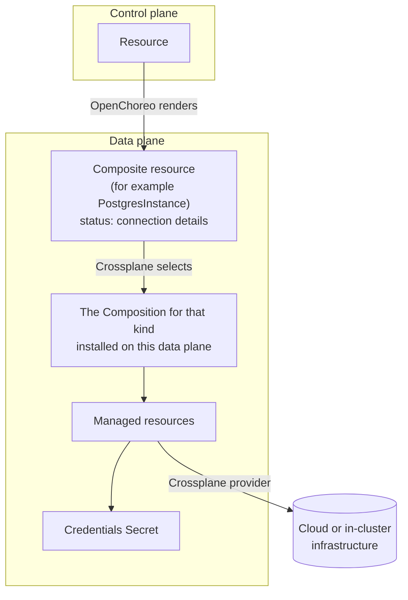

# Crossplane Provisioner for OpenChoreo

This module provisions managed infrastructure for OpenChoreo Resources using
[Crossplane](https://www.crossplane.io/) v2. Each ResourceType in it creates a Crossplane composite
resource (XR) in the cell namespace, and the data plane that receives it builds the actual
infrastructure through the Composition installed there.

The ResourceTypes do not name a cloud. The same Resource can be a managed cloud service on one data
plane and something else on another, and supporting another platform is a new Composition, without
changing the ResourceTypes or the Resources that use them.

> [!NOTE]
> These ResourceTypes and Compositions are working examples designed to demonstrate the integration
> between OpenChoreo and Crossplane. Before using them in production, adapt them to your environment
> and requirements, such as resource sizing, high availability, networking, and backup settings.

## Resources

| Resource | ResourceType | Composite resource | Backings | Guide |
| :------- | :----------- | :----------------- | :------- | :---- |
| PostgreSQL | `postgres-crossplane` | `PostgresInstance` | Azure | [apis/postgres/README.md](apis/postgres/README.md) |
| Redis | `redis-crossplane` | `RedisInstance` | Azure | [apis/redis/README.md](apis/redis/README.md) |

## Backings

| Backing | Resources | Guide |
| :------ | :-------- | :---- |
| Azure | PostgreSQL, Redis | [azure/README.md](azure/README.md) |

## Features

- Developers request infrastructure with a `Resource`, and the platform injects its connection
  details into the Workloads that depend on it
- Credentials stay on the data plane, in a Secret, and never reach the control plane
- The data plane decides where infrastructure runs, so the ResourceTypes stay cloud neutral

## How it works



Once the infrastructure is reachable, the Composition publishes its connection details in two places,
and the ResourceType turns each into an output:

- **Non-secret details**, such as a host, port or database name, go in the composite resource's
  status. They become `value` outputs, which the control plane stores on the
  `ResourceReleaseBinding`.
- **Credentials** go in a Secret in the same namespace. They become `secretKeyRef` outputs, so only
  the Secret's name and key reach the control plane.

Each resource's guide lists its exact outputs and where each one comes from.

| Path | What it is | Apply on |
| :--- | :--------- | :------- |
| [`functions.yaml`](functions.yaml) | The composition functions every Composition runs | Every data plane |
| [`cluster-agent-crossplane-rbac.yaml`](cluster-agent-crossplane-rbac.yaml) | Lets the data-plane agent manage the module's composite resources | Every data plane |
| `apis/<resource>/definition.yaml` | The XRD, the contract every Composition for that resource implements | Every data plane that offers the resource |
| `apis/<resource>/resource-type.yaml` | The ClusterResourceType developers use | Control plane |
| `<backing>/` | The provider, its credentials, the data plane's settings and the Compositions for one platform | Data planes that use that backing |

In a single-cluster setup, such as the k3d quick start, all of it goes on the same cluster.

## Install

All steps except the last run against the cluster running the OpenChoreo **data plane**.

### 1. Install Crossplane

```bash
helm repo add crossplane-stable https://charts.crossplane.io/stable
helm repo update crossplane-stable

helm upgrade --install crossplane crossplane-stable/crossplane \
  --namespace crossplane-system --create-namespace \
  --version 2.4.2 --wait
```

This runs two pods in `crossplane-system`, `crossplane` and `crossplane-rbac-manager`. The
`crossplane` pod may restart once on first start, before its certificates are in place.

### 2. Install the composition functions

The Compositions are pipelines of
[composition functions](https://docs.crossplane.io/latest/composition/compositions/). Each runs as
its own pod.

```bash
kubectl apply -f functions.yaml
kubectl wait function --all --for=condition=Healthy --timeout=5m
```

### 3. Grant the data-plane agent access

The OpenChoreo data-plane agent has no permission on the module's composite resources by default.

```bash
kubectl apply -f cluster-agent-crossplane-rbac.yaml
```

The grant covers every kind in the module's API group, `crossplane.community.openchoreo.dev`, and
nothing else. Crossplane creates the cloud resources under its own permissions.

### 4. Install the APIs

Apply the XRD for each resource this data plane should offer, from the [Resources](#resources)
table:

```bash
# PostgreSQL
kubectl apply -f apis/postgres/definition.yaml
kubectl wait xrd postgresinstances.crossplane.community.openchoreo.dev --for=condition=Established

# Redis
kubectl apply -f apis/redis/definition.yaml
kubectl wait xrd redisinstances.crossplane.community.openchoreo.dev --for=condition=Established
```

### 5. Set up a backing

Follow the guide for the backing this data plane uses, from the [Backings](#backings) table. It
installs the Crossplane providers, their credentials and the Compositions.

### 6. Add the ResourceTypes

Apply these on the cluster running the OpenChoreo **control plane**, for each resource the data
planes offer:

```bash
kubectl apply -f apis/postgres/resource-type.yaml
kubectl apply -f apis/redis/resource-type.yaml
```

## Using your own Crossplane APIs

If your platform team already has Crossplane XRDs, a ResourceType can create those instead.
[`apis/postgres/resource-type.yaml`](apis/postgres/resource-type.yaml) is the pattern to follow:

- The XRD must be namespaced (`scope: Namespaced`, the default in Crossplane v2), and the
  ResourceType renders the XR into `${metadata.namespace}`, the cell namespace.
- Non-secret connection details should come from the XR's status as `value` outputs, and
  credentials from a Secret the Composition writes into the same namespace, as `secretKeyRef`
  outputs. v2 XRs have no connection details of their own.
- `readyWhen` on the XR's `Ready` condition makes the binding wait for Crossplane.
- Grant the data-plane agent access to your XRD's API group, as
  [`cluster-agent-crossplane-rbac.yaml`](cluster-agent-crossplane-rbac.yaml) does for this module's.

## Adding a resource

A resource is a directory under [`apis/`](apis), like [`apis/postgres/`](apis/postgres), with:

- an XRD in the `crossplane.community.openchoreo.dev` group, namespaced, that states in its status
  schema what every Composition must publish
- a ClusterResourceType that creates it, following the outputs rule in
  [How it works](#how-it-works)
- a README with the parameters, settings and outputs, and samples

Where it fits, offer the same per-environment `size` setting as the existing resources (`small`,
`medium`, `large`), which each backing maps to its own sizes. Then add a Composition for it to each
backing that should support it. The agent grant already covers the new kind.

## Adding a backing

A backing is a directory next to [`azure/`](azure), with a README, the providers and credentials it
needs, an EnvironmentConfig for per-data-plane settings, and a Composition for each resource it
supports. Settings shared by every resource go at the top level of the EnvironmentConfig, and
settings for one resource under its own key.

Install only the Compositions a data plane should use. Crossplane uses the only Composition for a
type when there is exactly one on the cluster. With more than one, set `spec.defaultCompositionRef`
on the XRD, or Crossplane picks one of them at random.

Check a Composition without a cluster with
[`crossplane composition render`](https://docs.crossplane.io/latest/cli/command-reference/), which
runs its functions locally in Docker and prints what Crossplane would create. The Azure guide has an
example.

## Uninstall

Remove the infrastructure before Crossplane. If a provider is removed while its resources still
exist, the infrastructure keeps running with nothing left to delete it.

```bash
# 1. Delete every binding of the module's Resources, then wait until no
#    composite resource is left
kubectl get composite -A

# 2. Remove each backing, following the uninstall steps in its guide

# 3. On the control plane: remove the ResourceTypes
kubectl delete --ignore-not-found -f apis/postgres/resource-type.yaml
kubectl delete --ignore-not-found -f apis/redis/resource-type.yaml

# 4. On the data plane: remove the APIs, the agent grant, the functions and Crossplane
kubectl delete --ignore-not-found -f apis/postgres/definition.yaml
kubectl delete --ignore-not-found -f apis/redis/definition.yaml
kubectl delete -f cluster-agent-crossplane-rbac.yaml
kubectl delete -f functions.yaml
helm uninstall crossplane -n crossplane-system
kubectl delete namespace crossplane-system

# 5. helm uninstall keeps Crossplane's CRDs. Remove them only if nothing else on
#    the cluster uses Crossplane, since deleting a CRD deletes every object of that kind
kubectl get crd -o name | grep -E 'crossplane\.io$'
```

## Compatibility

| Component | Compatible version | Notes |
| :-------- | :----------------- | :---- |
| **Crossplane** | `2.4.x` | Verified against 2.4.2. Requires v2 for namespaced XRs and managed resources. |
| **Composition functions** | see [`functions.yaml`](functions.yaml) | `function-environment-configs` v0.8.0, `function-go-templating` v0.13.0, `function-auto-ready` v0.6.9 |
| **OpenChoreo** | `1.3.x` | Verified against 1.3.0. |

Each backing's guide lists the provider versions it was verified with.
